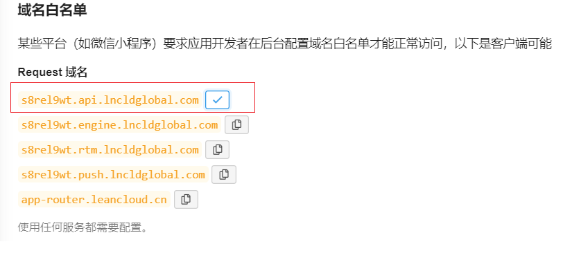
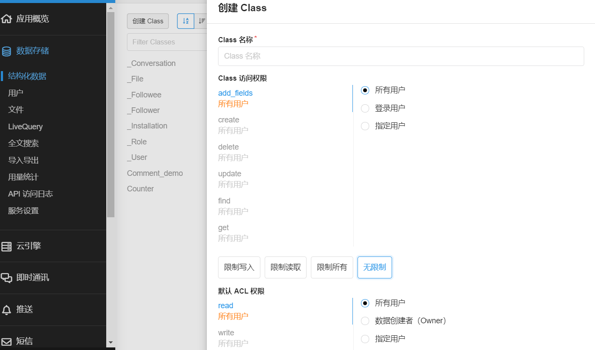
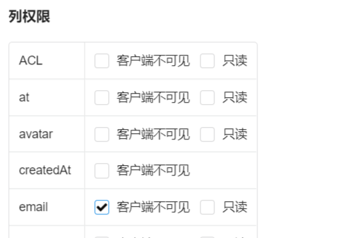
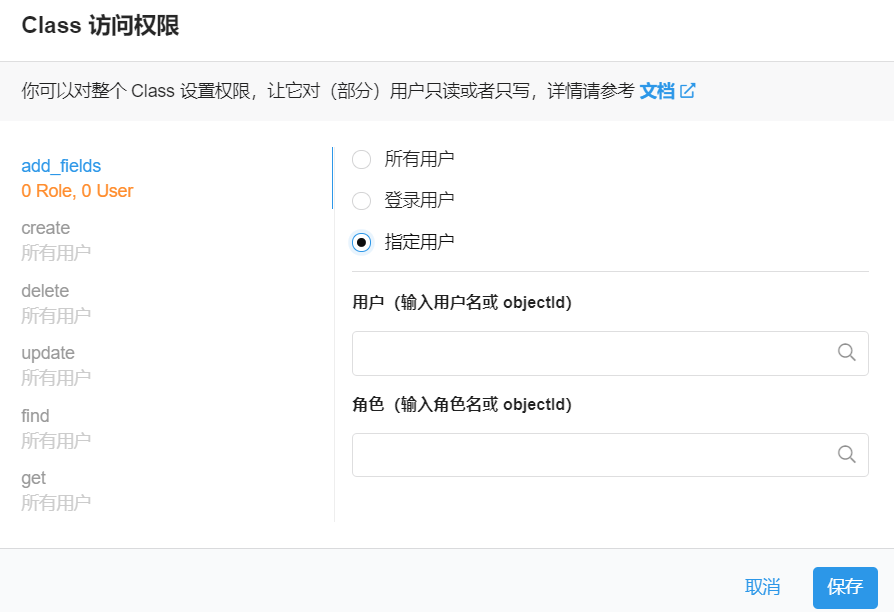
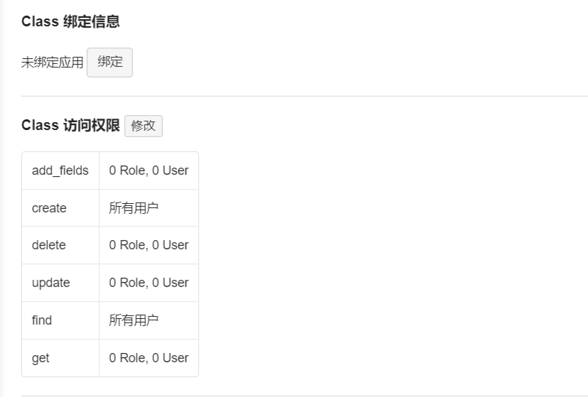

>> Serverless BBS(comment system) in Vue

English / [中文](https://github.com/stonehank/vue-bbs/blob/main/README.md)

## Support Server

* Leancloud


## Install

`npm install vue-bbs`


## Usage

`<vue-bbs />` The BBS main panel

`<vue-bbs-counter />` Current page total comment records count

`<vue-bbs-pageview />` Current page total page viewer


#### Global

```js
// index.js
import Vue from 'vue'
import bbs from 'vue-bbs'

Vue.use(bbs,{
    appId:"#########-####",
    appKey:"#######",
    serverURLs:"#####.##.##.com",
    CommentClass:"Comment",
    CounterClass:"Counter",
})
```
Then you can use `<vue-bbs>`,`<vue-bbs-counter>`,`<vue-bbs-pageview>` anywhere


#### Local

Register
```js
// index.js
import Vue from 'vue'
import register from 'vue-bbs/register'

register(Vue,{
    appId:"#########-####",
    appKey:"#######",
    serverURLs:"#####.##.##.com",
    CommentClass:"Comment",
    CounterClass:"Counter",
})
```

Use in `some-component.vue`
```vue

<template>
    <section>
        <span>评论数：<vue-bbs-counter /></span>
        <span>页面浏览量：<vue-bbs-pageview /></span>
        <vue-bbs :nest="2" :pageSize="10" />
    </section>
</template>

<script>
    import VueBbs from "vue-bbs/vue-bbs";
    import VueBbsCounter from "vue-bbs/vue-bbs-counter";
    import VueBbsPageview from "vue-bbs/vue-bbs-pageview";

    export default {
        name: "App",
        components:{
            VueBbs,
            VueBbsCounter,
            VueBbsPageview,
        },
    }
</script>
```


## Props

#### Register

|prop|required|description|default|
|:---:|:---:|:---:|:---:|
|appId|required|appId in leancloud|null|
|appKey|required|appKey in leancloud|null|
|serverURLs|optional|LeanCloud api address([How to get](#serverURLs))|null|
|CommentClass|required|Comment class name in leancloud|Comment|
|CounterClass|required|Pageview class name in leancloud|Counter|

#### Component vue-bbs

|prop|required|description|default|
|:---:|:---:|:---:|:---:|
|nest|optional|Defined the nest layers of the reply list|1|
|pageSize|optional|Defined the comment records in one time render|10|
|[uniqStr](#uniqstr)|optional|A unique string, use for fetch the specific page comment list|location.origin + location.pathname|


#### Component vue-bbs-counter

|prop|required|description|default|
|:---:|:---:|:---:|:---:|
|size|optional|Loading icon size|16|
|[uniqStr](#uniqstr)|optional|A unique string, use for fetch the specific page comment records count|location.origin + location.pathname|

#### Component vue-bbs-pageview

|prop|required|description|default|
|:---:|:---:|:---:|:---:|
|size|optional|Loading icon size|16|
|[uniqStr](#uniqstr)|optional|A unique string, use for fetch the specific page view|location.origin + location.pathname|


## Client Setting

#### APP ID/Key

[login](https://leancloud.cn/dashboard/login.html#/signin) or 
[register](https://leancloud.cn/dashboard/login.html#/signup) `LeanCloud`, 
enter [controller](https://leancloud.cn/dashboard/applist.html#/apps) 
click [create app](https://leancloud.cn/dashboard/applist.html#/newapp)


#### serverURLs



#### 创建 Comment 表

1. 在应用菜单->数据储存->结构化数据，点击`创建Class`，输入表名称`Comment`(也可以自定义)，自定义需要将名称传递给`react-valine`

    权限选择无限制，如图
    
    

2. 直接发送一条测试消息，系统会自动创建 `Comment`表

#### 配置 Comment 表

在客户端 `Comment` 表中(也可能是你的自定义名称`CommentClass`)

1. 勾选 `mail`列的`客户端不可见`
    
    

2. 如果表内字段为空，发送一条测试消息，让系统创建字段，接着可以关闭`add_fields`权限

    
    
#### 配置 _User 表

当你在`LeanCloud`客户端开启一个新的应用后，新创建的应用的 _User 表默认关闭了 find 权限，需要手动打开find权限，设置为`所有用户`




## Q & A

#### uniqStr

It's good to pass uniqStr manually for every different page.

For every different page, we should have different key to fetch the comment records, by default, the uinqStr is `location.origin + location.pathname`

But in some case which page url have hash, 

e.g.
 
1. If you want to fetch the page `b` reply counts in page `a`.

2. Two pages have same URL exact the different hash

In the above case, by the default uniqStr, it can't fetch the correct comment records.
