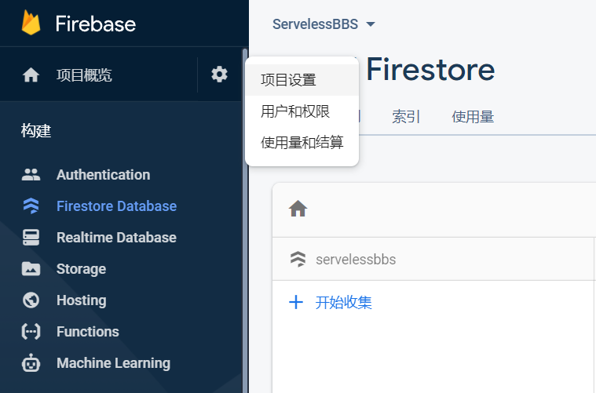
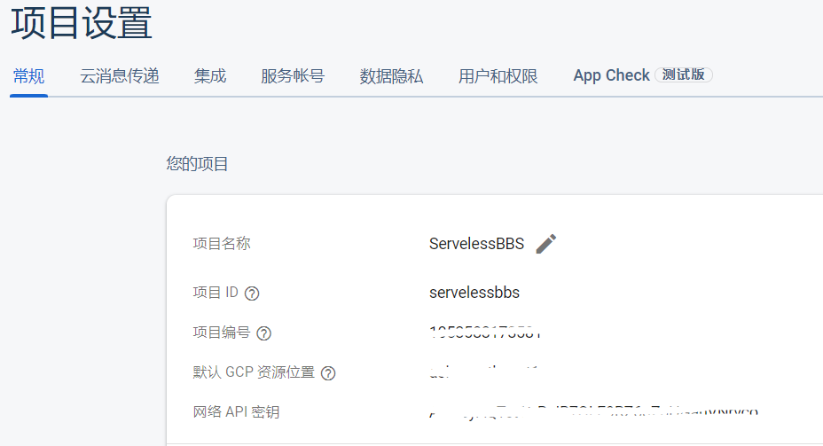
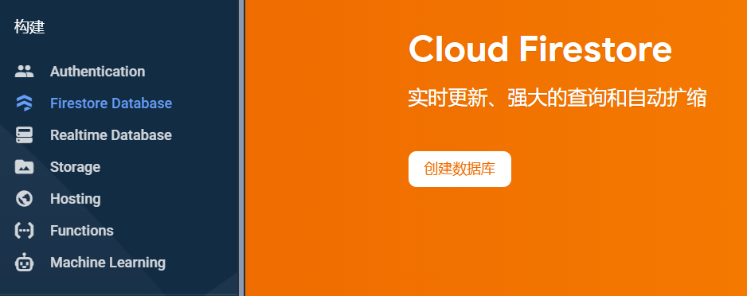
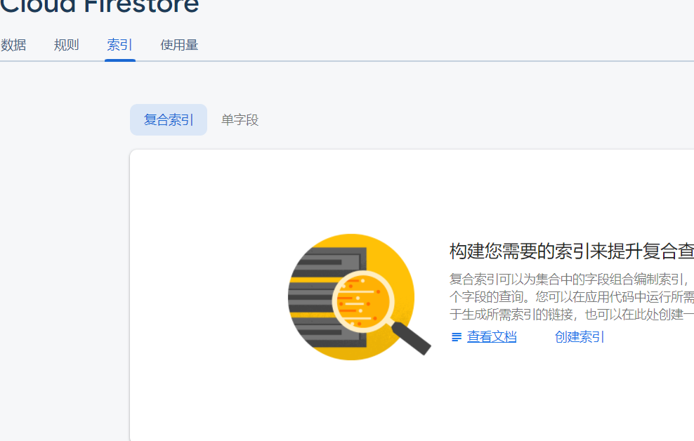
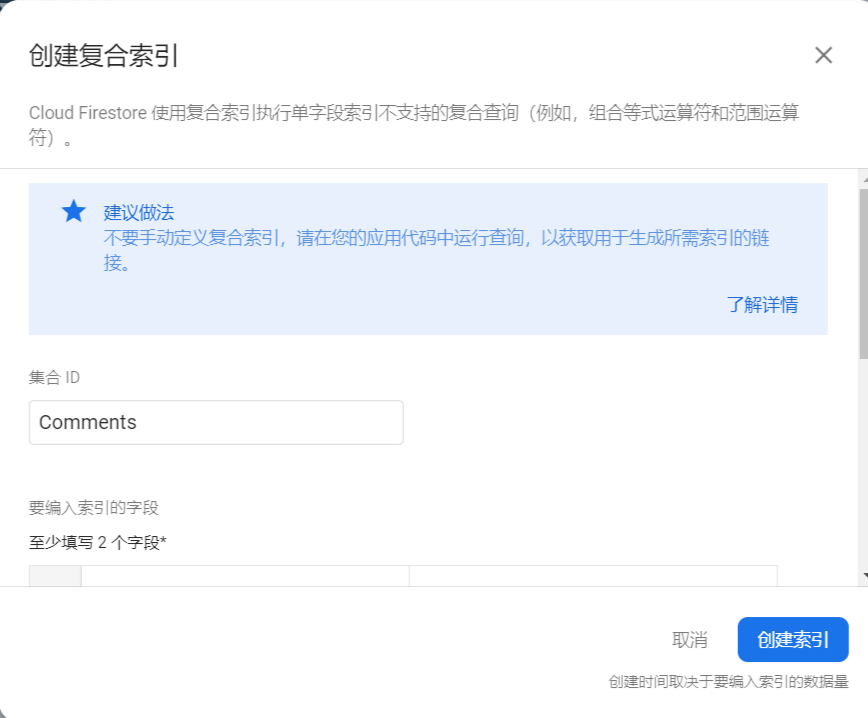
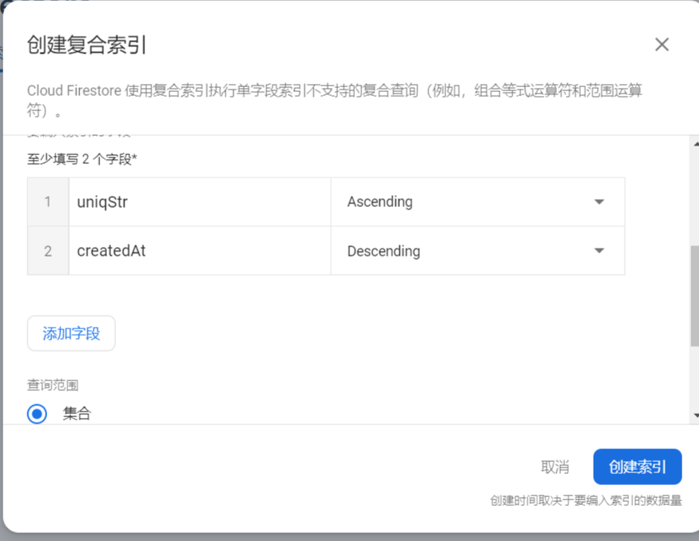

> Serverless BBS(comment system) in Vue

[English](https://github.com/stonehank/vue-bbs/blob/main/README-EN.md) / 中文

## 目前支持的服务器

* [Leancloud](#Leancloud客户端设置)
* [Firebase](#Firebase客户端设置)


## 安装

`npm install vue-bbs`


## 使用

`<vue-bbs />` 评论系统最主要部分，包括评论，回复查看等

`<vue-bbs-counter />` 当前页面的评论总数

`<vue-bbs-pageview />` 当前页面的页面浏览量


#### 全局引入

```js
// index.js
import Vue from 'vue'
import bbs from 'vue-bbs'

Vue.use(bbs,{
    appId:"#########-####",
    appKey:"#######",
    serverURLs:"#####.##.##.com",
    CommentClass:"Comment",
    CounterClass:"Counter",
})
```
接着，便可以在任意处使用 `<vue-bbs>`,`<vue-bbs-counter>`,`<vue-bbs-pageview>`


#### 局部引入

首先注册
```js
// index.js
import Vue from 'vue'
import register from 'vue-bbs/dist/register'

register(Vue,{
    appId:"#########-####",
    appKey:"#######",
    serverURLs:"#####.##.##.com",
    CommentClass:"Comment",
    CounterClass:"Counter",
})
```

在`some-component.vue`使用
```vue

<template>
    <section>
        <span>评论数：<vue-bbs-counter /></span>
        <span>页面浏览量：<vue-bbs-pageview /></span>
        <vue-bbs :nest="2" :pageSize="10" />
    </section>
</template>

<script>
    import VueBbs from "vue-bbs/dist/vue-bbs";
    import VueBbsCounter from "vue-bbs/dist/vue-bbs-counter";
    import VueBbsPageview from "vue-bbs/dist/vue-bbs-pageview";

    export default {
        name: "App",
        components:{
            VueBbs,
            VueBbsCounter,
            VueBbsPageview,
        },
    }
</script>
```


## Leancloud客户端设置

#### APP ID/Key

[登录](https://console.leancloud.app/login) `LeanCloud`, 
进入 [控制台](https://console.leancloud.app/apps/) 
后点击创建应用


应用创建好以后，进入刚刚创建的应用，选择左下角的`设置`>`应用Key`，然后就能看到你的`APP ID`和`APP Key`了：


#### serverURLs

`serverURLs`在应用内部会尝试自动获取，如果发现获取失败，请手动提供
刚刚创建的应用，选择左下角的`设置`>`应用Key`，找到`Request 域名` 第一行


#### 初始化

应用内部直接发送一条测试消息，系统会自动创建对应的`Comment`表和`Counter`表

#### 配置 Comment 表

在客户端 `Comment` 表中(也可能是你的自定义名称`CommentClass`)

1. 勾选 `mail`列的`客户端不可见`
    
    

2. 关闭`add_fields`权限

    
    
#### 配置 _User 表

当你在`LeanCloud`客户端开启一个新的应用后，新创建的应用的 _User 表除了`create`，其他全部权限关闭


至此， Leancloud 构建完毕！


## Firebase客户端设置

[登录](https://console.firebase.google.com/) `Google`账号并且进入`Firebase`控制台，创建项目

#### apiKey

点击左上方小齿轮，进入`项目设置`



找到你的`项目id`和`api密钥`



要使用`Firebase`，`vue-bbs`需要接收

```
apiKey: [Your API Key]
authDomain: [Your Project ID].firebaseio.com
projectId: [Your Project ID]
```
#### Authentication配置

点击左侧栏`Authentication`，点击`启用`->`设置登录方法`，选择`电子邮件`，点击`启用`，`保存`


#### Firebase配置


* 启用Database

    左侧栏选择`Firestore Database`，选择创建数据库
    
    
    
    选择生产模式或者测试模式都可以，后面会覆盖掉规则配置;
    
    选择地区位置后，创建成功

* 重写规则

    复制以下规则，注意其中方括号内`[YourComments]`和`[YourCountres]`需要替换成你自定义的存放评论表格名称和存放页面浏览量的表名称
    
    点击发布
    ```
    service cloud.firestore {
      match /databases/{database}/documents {
        match /[YourComments]/{id} {
          allow read: if true;
          allow create: if true;
          allow update: if  request.auth != null 
          &&  request.auth.uid == resource.data.user_id 
          allow delete: if false;
        }
         match /[YourComments]_private/{id} {
          allow read: if false;
          allow create: if true;
          allow update: if  request.auth != null 
          &&  request.auth.uid == id;
          allow delete: if false;
        }
         match /[YourCounter]/{id} {
          allow read: if true;
          allow create: if true;
          allow update: if true;
          allow delete: if false;
        }
      }
    }
    ```

* 建立索引

    点击`索引` -> `复合索引` ->创建
    
    
    
    填写你的`Comment`表格名称
    
    
    
    添加字段`uniqStr`和`createdAt`，分别为`Ascending`和`Descending`, 选择查询范围`集合`
    
    
    
    点击创建索引，索引构建大概会消耗几分钟时间


至此， Firebase 构建完毕！

## 选项

#### 注册

|参数|是否必须|说明|默认值|
|:---:|:---:|:---:|:---:|
|appId|是|leancloud上的appId|null|
|appKey|是|leancloud上的appKey|null|
|serverURLs|否|LeanCloud的请求API([怎样获取](#serverURLs))|自动获取|
|CommentClass|是|在`leancloud`上存放**评论**的Class名称|Comment|
|CounterClass|是|在`leancloud`上存放**页面阅读量**的Class名称|Counter|

#### Component vue-bbs

|prop|required|description|default|
|:---:|:---:|:---:|:---:|
|nest|否|定义回复嵌套的层数|1|
|pageSize|否|评论列表分页，每页条数|10|
|offset|否|当点击回复时，自动滚动的offset，适用于`fixed`菜单的项目|0|
|[uniqStr](#uniqStr)|否|一个独立值，用于获取当前页面评论|location.origin + location.pathname|

#### Component vue-bbs-counter

|prop|required|description|default|
|:---:|:---:|:---:|:---:|
|size|否|Loading图标大小|16|
|[uniqStr](#uniqStr)|否|一个独立值，用于获取当前页面评论|location.origin + location.pathname|

#### Component vue-bbs-pageview

|prop|required|description|default|
|:---:|:---:|:---:|:---:|
|size|否|Loading图标大小|16|
|[uniqStr](#uniqStr)|否|一个独立值，用于获取当前页面评论|location.origin + location.pathname|


## Q & A

### uniqStr

推荐手动传入`uniqStr`

每个页面的数据储存方式为`key:value`，因此每个页面有一个独立的字符串作为`key`，才能获取到页面的浏览数，评论数等数据，这个`key`称为`uniqStr`；

默认`uniqStr`使用当前页面`location.origin+location.pathname`，但是

1. 如果你在页面`b`想要获取页面`a`的评论数等数据，使用`location.origin+location.pathname`就会获取错误或者失败；
2. 如果两个页面的url完全相同，仅仅是`hash`不同，那么默认的`uniqStr`同样会获取失败

因此，对于每一个页面或者说每一个你定义的评论模块，建议手动提供一个`uniqStr`，这个`uniqStr`有以下特性：

1. 全局唯一
2. `uniqStr`对相同的页面一定有相同的值
